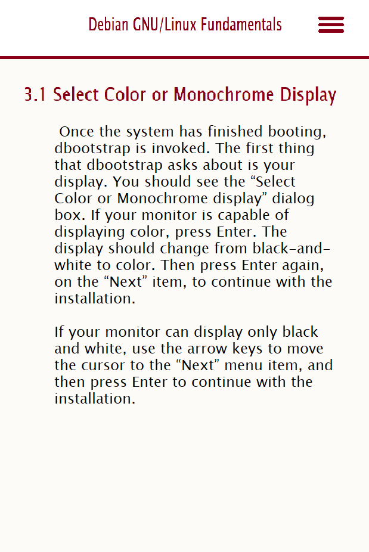
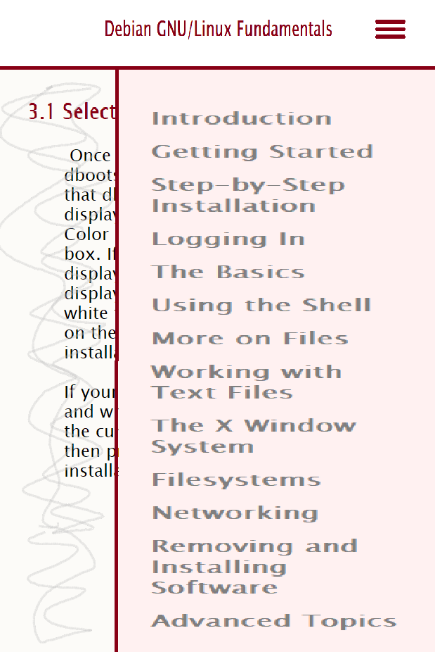
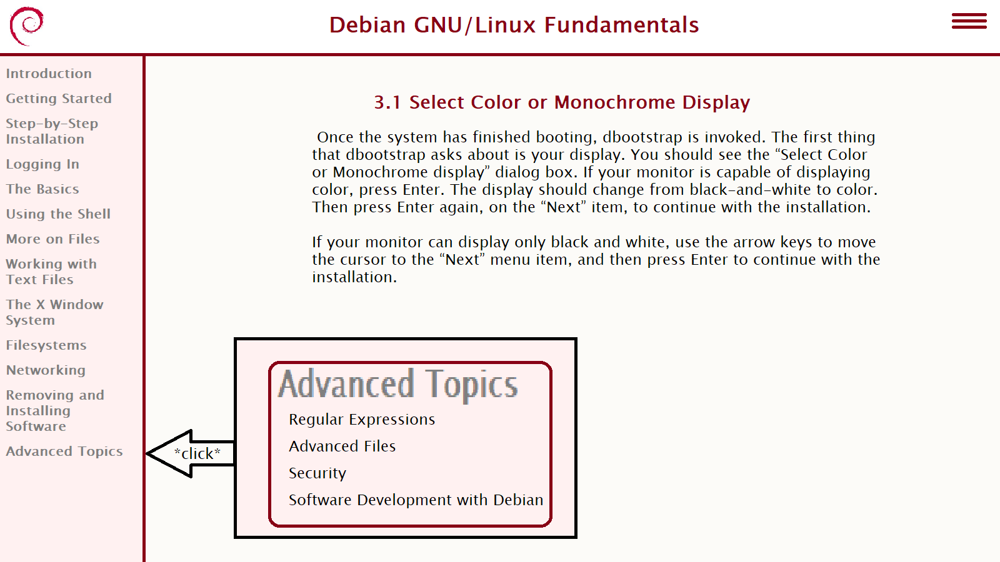

# Debian GNU/Linux Fundamentals
The 2001 guide for installing and using Debian.

## Data Source
[Debian GNU/Linux : Guide to Installation and Usage by Goerzen and Othman](https://www.gutenberg.org/ebooks/6527)

## Items of Interest
- Chapters

## Proposed Layout

